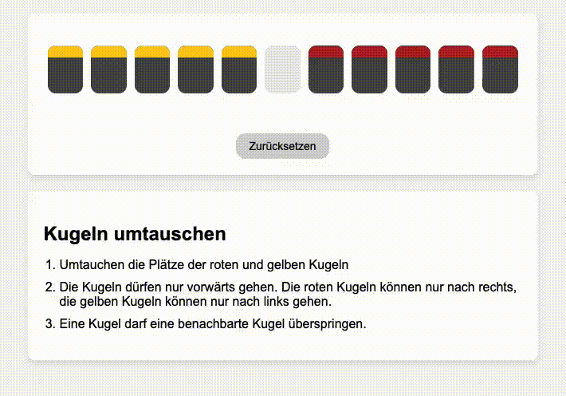

# Puzzle with JavaScript

We encountered this puzzle at the [*Museum der
Illusionen*](https://museumderillusionen.at/) in Vienna, where it was
presented in a physical form (with actual movable pieces featuring
slots and holes). It took us some time to solve it. To document that
fun experience, I recreated the puzzle using JavaScript. I also used
assistance from ChatGPT, making this project a showcase for prompt
engineering.

## How it works

<div style="text-align: center;">
  
</div>


## Puzzle Rules

1. **Objective**: Exchange the positions of the red and yellow pieces.

   At the start, there are 5 red pieces in the leftmost 5 slots and 5
   yellow pieces in the rightmost 5 slots, with one empty slot between
   them. The goal is to swap their positions, so the red pieces end up
   on the right and the yellow pieces on the left.

2. **Movement Direction**:  
   - Red pieces can move only to the right.  
   - Yellow pieces can move only to the left.

3. **Basic Movement**: A piece can move into the adjacent unoccupied slot.

4. **Jumping Rule**: A piece can jump over one neighboring piece into
   the empty slot, but only one piece at a time.

## How to start

1. Clone the repo.
   ```
   git clone https://github.com/megnergit/Puzzle_Swap_J1.git
   ```

2. Load ```index.html```

3. One can reset and come back to the initial state anytime by clicking
   'Zurücksetzen' button.


## Directory structure

```
meg@elias $ tree ./
./
├── README.md
├── images
│   └── kugelnx2.gif
├── index.html
├── puzzle.js
└── styles.css

```


<!-- ------------------------------  -->

# END

<!-- ####################  -->
